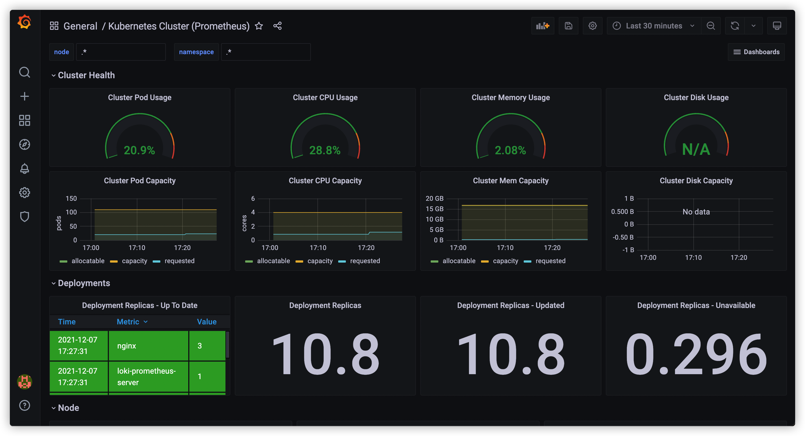
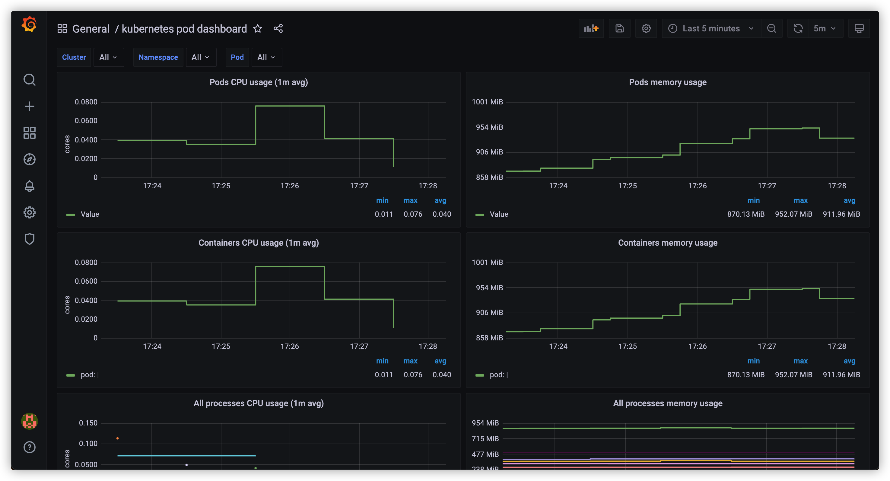
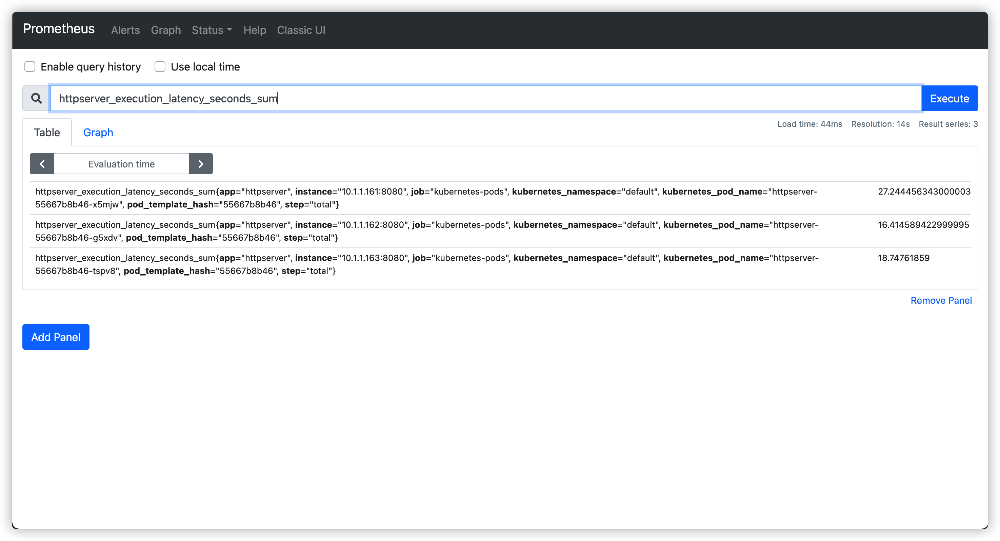
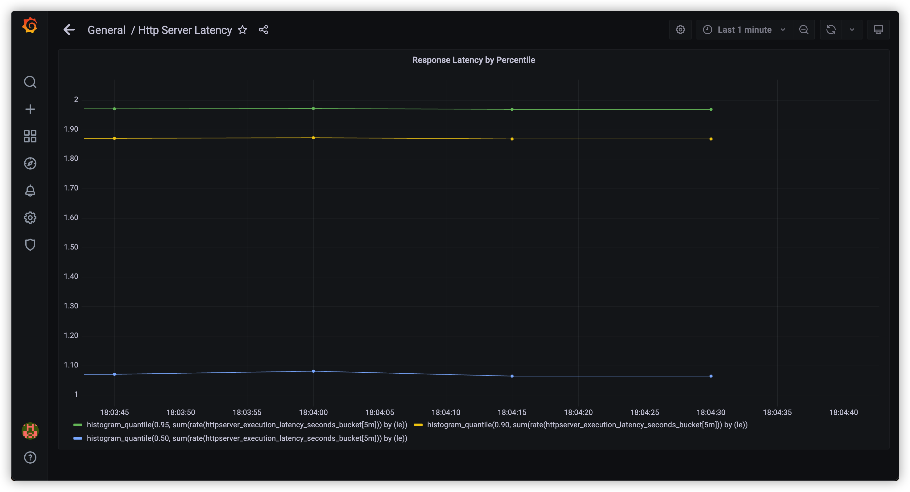
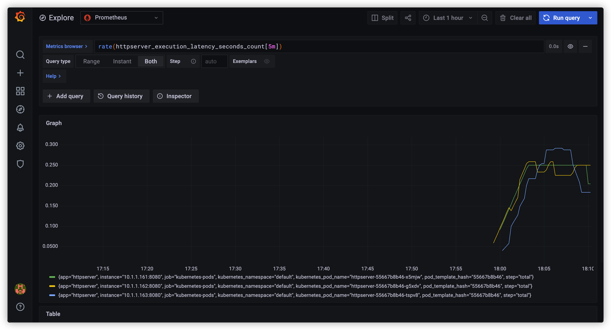
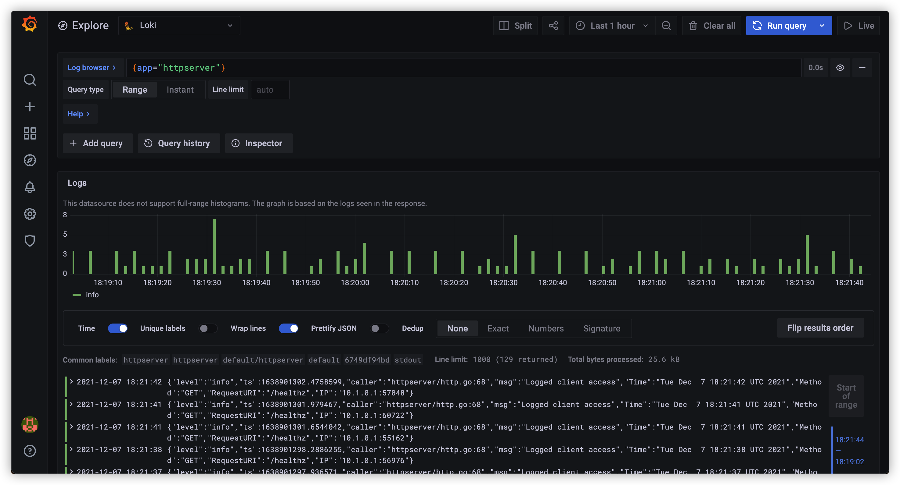

# cncamp_homework

<a href="https://github.com/SignorMercurio/cncamp_homework/actions"></a>
<a href="https://codecov.io/gh/SignorMercurio/cncamp_homework"></a>

<details>
<summary></summary>

## httpserver

A simple HTTP server that you may:

- Access `/header` to find your Request Headers in the Response Headers
- Access `/version` to get the VERSION environment variable
- Access `/log` to write logs in the server
- Access `/healthz` for a health check

### Sample usage

Start a server on `0.0.0.0:8080`:

```shell
$ ./httpserver :8080
```

### Note for Dockerfile

- When using Apple M1 to play with docker, it pulls and builds images for linux/arm/v8 platform by default.
- In order to build images for other platform, you may find [buildx](https://docs.docker.com/buildx/working-with-buildx/) helpful.
- OR, you may also make use of GitHub Actions to avoid the issue.
- When using `alpine` as the base image to run a go binary, `CGO_ENABLED=0` must be set when building due to a different libc implementation on `alpine`. Replacing the dynamic link library also helps.

### Note for Google Cloud Platform

- Running `gcloud --quiet auth configure-docker` requires the service account to have the permission to create bucket. For instance, `Storage Admin` role works, but it's clearly not the least
  privilege you can grant.
- You'll need `Kubernetes Engine Developer` / `Kubernetes Engine Admin` role for your service account.
- `secrets.GKE_PROJECT`: GKE's Project ID
- `secrets.GKE_SA_KEY`: Base64 encoded JSON key of your service account

### Things to modify for a different golang app

- Target binary name in `Dockerfile`
- Entrypoint command in `Dockerfile`
- Kubernetes and kustomize yaml files in `base` directory
- _Deploy to GKE_ workflow in `.github/workflows/gke.yml`
  - `env`
  - `secrets.GKE_PROJECT`
  - `secrets.GKE_SA_KEY`

</details>

<details>
<summary></summary>

## Docker

Build a multi-stage docker image for httpserver.

> See [Dockerfile](Dockerfile).

</details>

<details>
<summary></summary>

## Kubernetes

Deploy httpserver on Kubernetes. Based on the first homework, I would like to deploy it on Google Kubernetes Engine.

### Changes in httpserver

- Deprecate `valyala/fasthttp`, use `net/http` and `gorilla/mux`
- Add unit tests, coverage 100%
- Add graceful termination when receiving SIGTERM
- Add support for structured & leveled logging
  - Deprecate `log`, use `uber-go/zap`
  - Add a logging middleware
  - Support structured & leveled logging

### Features

- [x] CI / CD with GitHub Actions
  - [x] CI: Codecov
  - [x] CD: Deploy to GKE
- [x] Resource limit and request
- [x] Health check
  - [x] Readiness probe
  - [x] Liveness probe
- [x] Graceful initialization with postStart
- [x] Graceful termination in httpserver source code
- [x] Configurations with ConfigMap
- [x] Structured & leveled logging
- [x] Logs stored in a mounted volume
- [x] Ingress with HTTPS

### Notes

To deploy httpserver locally:

1. Comment out `secret.yaml` and `ingress.yaml` in `base/kustomization.yml`, they're designed for GKE deployment:

```yaml
apiVersion: kustomize.config.k8s.io/v1beta1
kind: Kustomization

resources:
  - deployment.yaml
  - service.yaml
  - configmap.yaml
# - secret.yaml
# - ingress.yaml
```

2. Replace container image in `base/deployment.yaml` with your local httpserver image, which can be built with:

```shell
$ docker build -t server:1.0.0 .
```

</details>

<details>
<summary></summary>

## Prometheus

Monitor httpserver with Loki, Prometheus and Grafana.

### Changes in httpserver

- Add random delay and Prometheus metrics in `metricsMiddleware`
- Logs will also be written to stdout now to be collected by Loki

### Features

- Collect metrics with Prometheus
- Collect logs with Loki
- View various metrics in both Prometheus and Grafana
- View logs with Loki in Grafana

### Notes

To install [loki-stack](loki-stack) on Kubernetes v1.22+, we need to change `rbac.authorization.k8s.io/v1beta1` to `rbac.authorization.k8s.io/v1`. Therefore, manual installation is required:

```shell
$ helm repo add grafana https://grafana.github.io/helm-charts
$ helm pull grafana/loki-stack
$ tar -xvf loki-stack-2.5.0.tgz

$ cd loki-stack
$ sed s#rbac.authorization.k8s.io/v1beta1#rbac.authorization.k8s.io/v1#g *.yaml
$ cd ..

$ helm upgrade --install loki ./loki-stack --set grafana.enabled=true,prometheus.enabled=true,prometheus.alertmanager.persistentVolume.enabled=false,prometheus.server.persistentVolume.enabled=false
```

### Demos

#### View Cluster Dashboard in Grafana



#### View Pod Dashboard in Grafana



#### View Server Latency Sum in Prometheus



#### View Server Latency with Prometheus in Grafana



#### View Server Events Count with Prometheus in Grafana



#### View Server Logs with Loki in Grafana



</detail>
